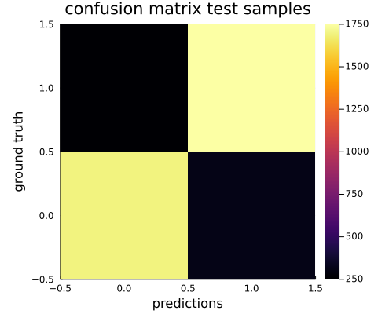
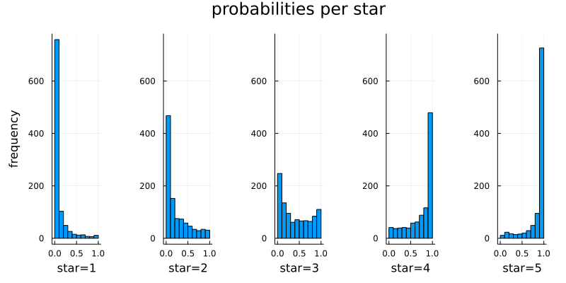
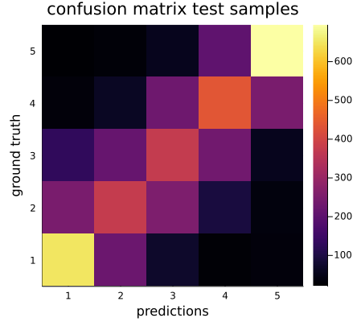
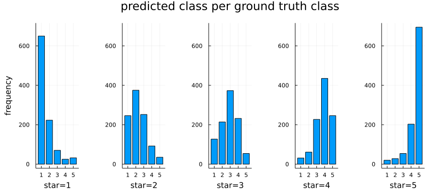

# TransformersLite Demo

Examples for the [TransformersLite.jl](https://github.com/LiorSinai/TransformersLite.jl) package.
This repository is meant for learning
and is paired with this [blog post](https://liorsinai.github.io/coding/2022/05/18/transformers.html). For a much more comprehensive package with APIs for HuggingFace, optimizations and more, please see Transformers.jl at [github.com/chengchingwen/Transformers.jl](https://github.com/chengchingwen/Transformers.jl).

## Setup

Download the Transformers (v0.5) Github repository (it is not registered) . Then install it via the Julia REPL:
```Julia-repl
julia> ] # enter package mode
(@v1.x) pkg> dev path\\to\\TransformersLite.jl
julia> using Revise # for dynamic editing of code
julia> using TransformersLite
```

To install the additional packages run:
```Julia-repl
julia> ] # enter package mode
(@v1.x) pkg> activate .
(TransformersLite-examples) instantiate 
```
Dependencies can also be installed manually in the main Julia environment.

The cuDNN library needs to installed separately for CUDA GPU functionality.
It is added as an artifact via the cuDNN package.

Optional packages:
- TokenisersLite: [https://github.com/LiorSinai/TokenizersLite](https://github.com/LiorSinai/TokenizersLite).
- BytePairEncoding: [https://github.com/chengchingwen/BytePairEncoding.jl](https://github.com/chengchingwen/BytePairEncoding.jl).

### Non-Julia Dependencies

Other than Julia this requires Python for:
- HuggingFace datasets package. 
- Jupyter notebooks.

## Generator

Train a transformer generator, which can be used for a Generative Pre-trained Transformer (GPT).

The text corpus used here is Shakespeare's plays from [Project Gutenberg](https://www.gutenberg.org/cache/epub/100/pg100.txt).

See [prepare_shakespeare.jl](data/Shakespeare/prepare_shakespeare.jl) for an automated preparation of the data.

Create a transformer and train it on the data:
```
mkdir examples\GPT\outputs
julia --project="." --threads auto examples/GPT/train_gpt.jl
```

Based on Andrej Karpthay's [Neural Networks: Zero to Hero](https://karpathy.ai/zero-to-hero.html) course.

### Results

Example text after training a 42,400 parameter model:

<blockquote>
<pre>
CLATIO.
No, Goe, him buchieds is, hand I was,
To queer thee that of till moxselat by twish are.

BENET.
Are warrain Astier, the Cowlles,
bourse and nope, Merfore myen our to of them coun-mothared man,
Here is
Mafter my thath and herop, and in in have low’t so, veriege a the can eeset thy
inscestle marriom.

ADY.
Thus him stome
To so an streeward. Here cas, which id renuderser what thou bee of as the hightseleh-to.

CHAESS.
With he mand, th’ fouthos. I purcot Lay,
You.

GATHENT.
Who, to hath fres
</pre>
</blockquote>

## Classifier
### Train

⚠️ WARNING: The dataset used here is no longer publicly available.

Download the [amazon_reviews_multi](https://huggingface.co/datasets/amazon_reviews_multi) dataset via the HuggingFace API:

```bash
python data/AmazonReviews/download_dataset.py
```

Create a transformer and train it on the data:
```
mkdir examples\classifier\outputs
julia --project="." --threads auto examples/classifier/demo.jl
```

### Results

The task was to predict the star rating on a 5 star scale given a review. 
A simpler task was also investigated to predict a positive or negative sentiment with 1-2 stars labelled negative, 4-5 stars labelled positive and 3 stars removed. Only the English subset of the dataset was used with 200,000 training samples and 5,000 test samples.

The accuracy achieved on the test data was:
- 86.9% for the binary task for a model with ~57,000 parameters.
- 88.5% for the binary task for a model which which scores each sentence individually and then aggregates their results with a parabolic weighted average. The model had ~60,000 parameters.
- 49.0% for the 5 star classification task for a model with ~57,000 parameters.

It should be noted that this task can be solved with simpler models. 
A TFIDF model paired with logistic regression with approximately 10,000 weights
achieved similar accuracy to these models.

#### Binary task


The confusion matrix shows that the binary model does indeed mostly predict the correct class.



The probabilities for each star are strongly biased in the right way, with 1 star ratings being mostly negative and 5 star ratings mostly positive. The model was not trained on 3 star reviews so here the distribution approaches a uniform distribution (random) with a negative skew. This negative skew may also be a reflection of the underlying data because humans are not consistent with their ratings for 3 stars. 

#### 5 star classification task


Looking at the confusion matrix for the 5 star classification, we can see that the model struggles more with the middle ratings of 2-4.
Again this is hypothesized  to be partially because of inconsistencies in the underlying data.



Seeing in another view as a bar chart, for each star the most likely prediction is the star itself.
However the distributions do have a spread and have significant overlaps of confusion.

## Notebooks

Run the evaluation notebooks (requires IJulia):
```
jupyter notebook
```
